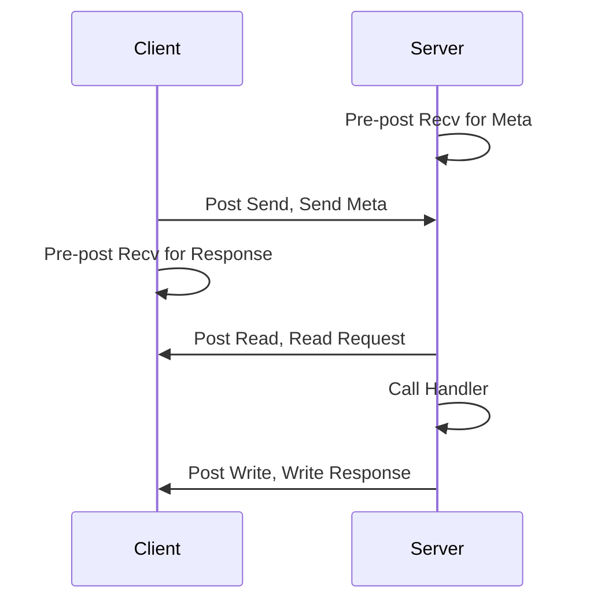
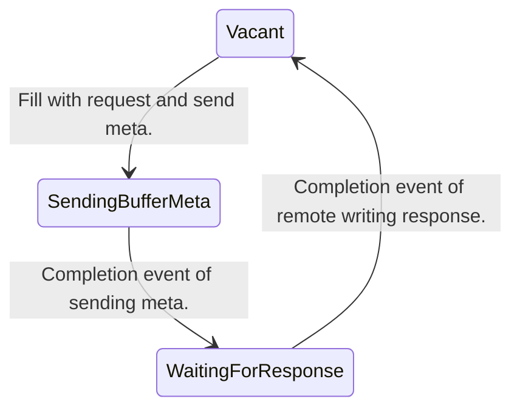
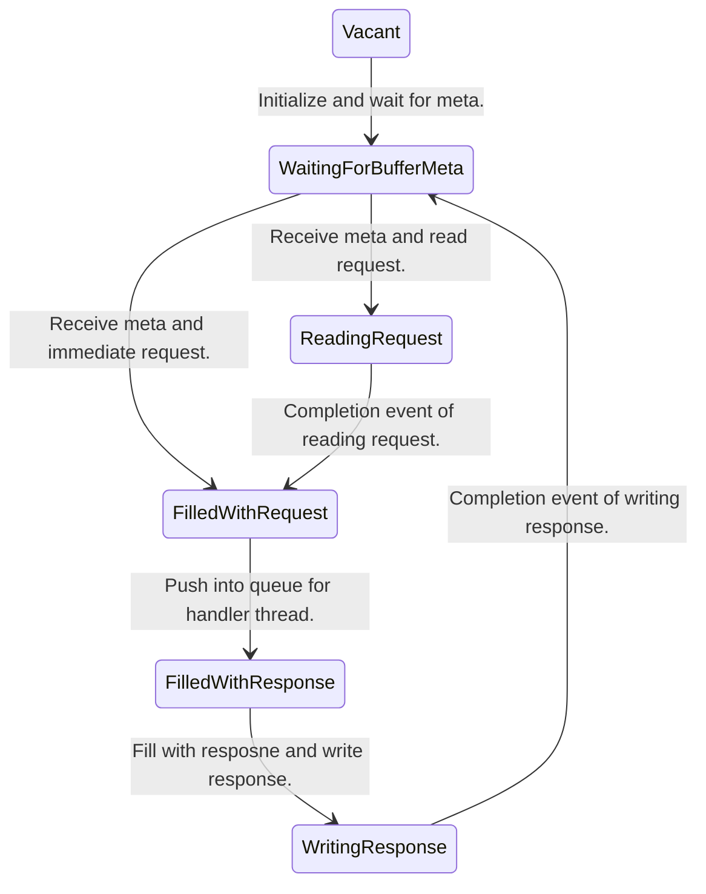

# RDMA-Based RPC

This is a quite simple RDMA-Based RPC implementation used in DPUKV.

## Prerequisite

- Build tool: meson, ninja

- Dependent library: libibverbs, librdmacm, libevent, pthread

- Dependent Environment: RDMA-enabled NIC, hugepages

> If not, use Soft-RoCE instead. Follow the commands bellow.
>
> ```bash
> modprobe rdma_rxe
> # bind a normal NIC
> sudo rdma link add rxe_0 type rxe netdev <your NIC name>
> # use `ip addr` to get the name
> ibv_devices # you will see a virtualized NIC named rxe_0
> ```

## How to use

### Build

It is better to use hugepages for NIC because of IOMMU. You can use option 'use_hugepage' to use anonymous hugepages as buffer.

```bash
meson build -Duse_hugepage=enabled
meson compile -C build
```

### Play

```bash
# start the server
./build/app/server <NIC ip> <port>

# start the client
./build/app/client <server ip> <server port>
```

## Design

### Connection Management

Register the rdma_cm_event_channel's fd into event loop.

### RPC Context FSM

One RPC Procedure



Client Side Context



Server Side Context



## To-do

- [x] basic connection management
- [x] add send and recv verbs
- [x] add read and write verbs
- [x] add ring for multi-client-calls
- [x] add background handler 
- [ ] add memory pool
- [ ] add raw api
- [x] use one poller for all connections
- [x] accelerate small rpc
- [ ] split request and replay

## Bug

- [x] when serving multiple connections, server may go wrong.

## Reference

- [Note](https://branch-nephew-4b8.notion.site/Basic-RDMA-Communication-Control-Flow-40e7c82d848e4c17b36eab9f1a170195)
- [RDMA Aware Networks Programming User Manual](https://docs.nvidia.com/networking/display/RDMAAwareProgrammingv17/RDMA+Aware+Networks+Programming+User+Manual)